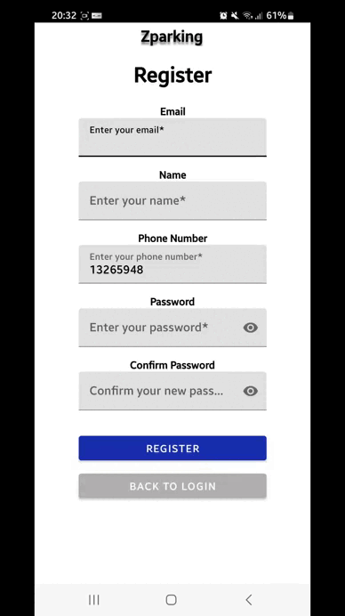
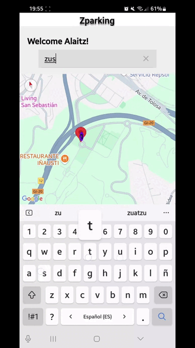
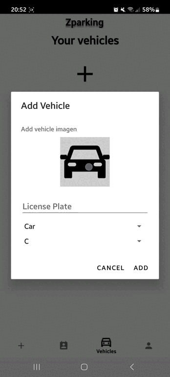
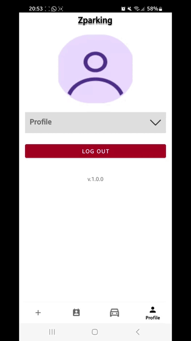

# 🚗 LKS-Zparking

**LKS-Zparking** es una aplicación móvil para el aula de empresa de LKS Next.  
El sistema permite a los usuarios consultar, reservar y gestionar plazas de parking de forma eficiente, moderna y visualmente atractiva.

**Versión actual:** `v1.0.0`

---

## 🧹 Tecnologías utilizadas

- **Frontend**: Prototipado en [Figma](https://www.figma.com/design/SxYk3acdpqNDgLus4lfpCv/LKS-Zparking-Alaitz?node-id=0-1&t=o4VmHH44NGnsZ5mi-1)
- **Backend**: Java con Android
- **Base de datos**: Firebase
- **Autenticación e integraciones**: APIs de Google para OAuth y Firebase

---

## 🎨 Diseño del Frontend

El diseño de la interfaz de usuario ha sido desarrollado con [**Figma**](https://www.figma.com/design/SxYk3acdpqNDgLus4lfpCv/LKS-Zparking-Alaitz?node-id=0-1&t=o4VmHH44NGnsZ5mi-1), permitiendo la creación de un sistema de navegación claro, visual y responsive que mejora la experiencia del usuario.

Puedes acceder al prototipo interactivo desde el siguiente enlace:

👉 [**Figma - LKS-Zparking**](https://www.figma.com/design/SxYk3acdpqNDgLus4lfpCv/LKS-Zparking-Alaitz?node-id=0-1&t=o4VmHH44NGnsZ5mi-1)

---

## 🚀 Funcionalidades principales

- Oauth con Google y recuperación de contraseña con Firebase.
- Consulta de disponibilidad de plazas de parking.
- Reserva y cancelación de plazas.
- Gestión de usuarios y roles.
- Visualización clara del estado del parking (ocupado, libre, reservado).
- Añadir tu propio vehículo.
- Configurar y personalizar tu perfil.
- *(Opcional)*: Integración con sensores o APIs externas para datos en tiempo real.

---

## 🎥 Demos en acción

A continuación puedes ver algunas demostraciones del funcionamiento de **LKS-Zparking**:

  
  
  
  

---

## 📦 Instalación

Solo tienes que clonar el repositorio:

   ```bash
   git clone https://github.com/Alaitz19/lks-zparking.git
   cd lks-zparking
